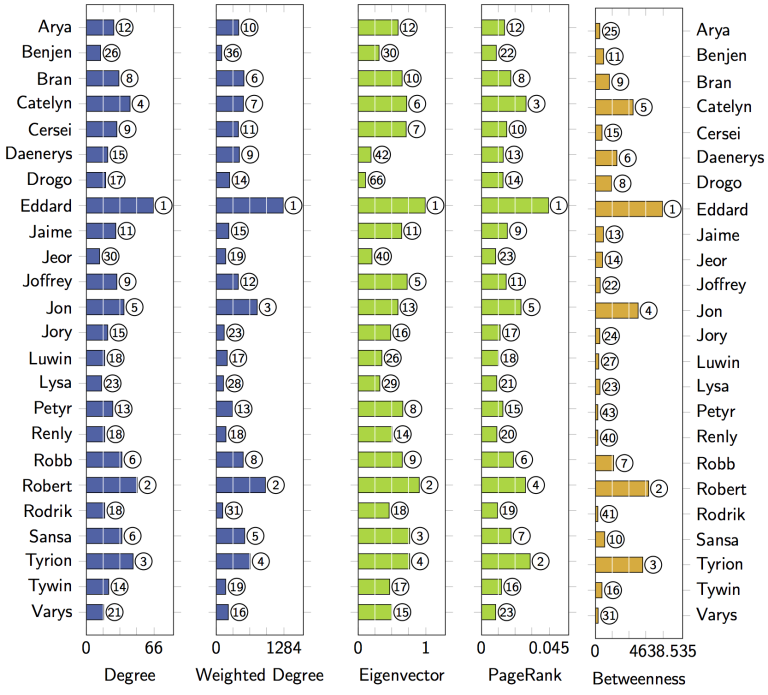
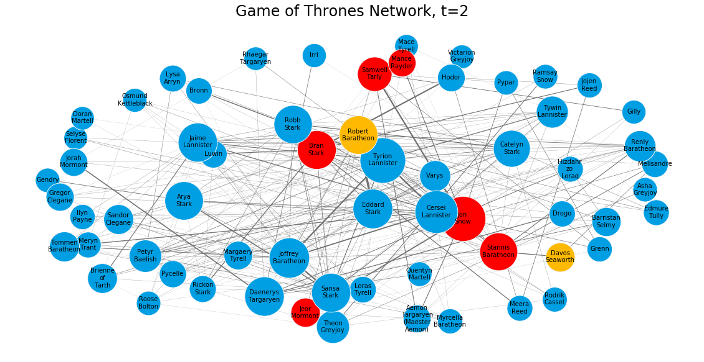

# Game of Thrones: Network Analysis

Winter is Coming. Let's load the dataset ASAP! If you haven't heard of Game of Thrones, then you must be really good at hiding. Game of Thrones is the hugely popular television series by HBO based on the (also) hugely popular book series A Song of Ice and Fire by George R.R. Martin. In this notebook, we will analyze the co-occurrence network of the characters in the Game of Thrones books. Here, two characters are considered to co-occur if their names appear in the vicinity of 15 words from one another in the books.

This dataset constitutes a network and is given as a text file describing the edges between characters, with some attributes attached to each edge. Let's start by loading in the data for the first book A Game of Thrones and inspect it.

```python
! pip install plotly
! pip install networkx
! pip install dash
```

    Requirement already satisfied: plotly in c:\programdata\anaconda3\lib\site-packages (4.6.0)
    Requirement already satisfied: retrying>=1.3.3 in c:\programdata\anaconda3\lib\site-packages (from plotly) (1.3.3)
    Requirement already satisfied: six in c:\programdata\anaconda3\lib\site-packages (from plotly) (1.14.0)
    Requirement already satisfied: networkx in c:\programdata\anaconda3\lib\site-packages (2.4)
    Requirement already satisfied: decorator>=4.3.0 in c:\programdata\anaconda3\lib\site-packages (from networkx) (4.4.1)
    Requirement already satisfied: dash in c:\programdata\anaconda3\lib\site-packages (1.11.0)
    Requirement already satisfied: dash-renderer==1.4.0 in c:\programdata\anaconda3\lib\site-packages (from dash) (1.4.0)
    Requirement already satisfied: Flask>=1.0.2 in c:\programdata\anaconda3\lib\site-packages (from dash) (1.1.1)
    Requirement already satisfied: future in c:\programdata\anaconda3\lib\site-packages (from dash) (0.18.2)
    Requirement already satisfied: dash-html-components==1.0.3 in c:\programdata\anaconda3\lib\site-packages (from dash) (1.0.3)
    Requirement already satisfied: plotly in c:\programdata\anaconda3\lib\site-packages (from dash) (4.6.0)
    Requirement already satisfied: dash-core-components==1.9.1 in c:\programdata\anaconda3\lib\site-packages (from dash) (1.9.1)
    Requirement already satisfied: dash-table==4.6.2 in c:\programdata\anaconda3\lib\site-packages (from dash) (4.6.2)
    Requirement already satisfied: flask-compress in c:\programdata\anaconda3\lib\site-packages (from dash) (1.4.0)
    Requirement already satisfied: Werkzeug>=0.15 in c:\programdata\anaconda3\lib\site-packages (from Flask>=1.0.2->dash) (1.0.0)
    Requirement already satisfied: click>=5.1 in c:\programdata\anaconda3\lib\site-packages (from Flask>=1.0.2->dash) (7.0)
    Requirement already satisfied: Jinja2>=2.10.1 in c:\programdata\anaconda3\lib\site-packages (from Flask>=1.0.2->dash) (2.11.1)
    Requirement already satisfied: itsdangerous>=0.24 in c:\programdata\anaconda3\lib\site-packages (from Flask>=1.0.2->dash) (1.1.0)
    Requirement already satisfied: six in c:\programdata\anaconda3\lib\site-packages (from plotly->dash) (1.14.0)
    Requirement already satisfied: retrying>=1.3.3 in c:\programdata\anaconda3\lib\site-packages (from plotly->dash) (1.3.3)
    Requirement already satisfied: MarkupSafe>=0.23 in c:\programdata\anaconda3\lib\site-packages (from Jinja2>=2.10.1->Flask>=1.0.2->dash) (1.1.1)

```python
import pandas as pd
import plotly.graph_objects as go
import networkx as nx
import matplotlib.pyplot as plt
import matplotlib as mpl
import numpy as np

plt.rcParams["figure.figsize"] = (20,10)
import tqdm as tqdm

from IPython.core.display import display, HTML
display(HTML("<style>.container { width:80% !important; }</style>"))
```

<style>.container { width:80% !important; }</style>

## Network Analysis graph for the books using Gephi

### 1. Network graph from the 1st book


### Centralities from the 1st book



### 2. Network graph from the 2nd book


### Centralities from the 2nd book


### 3. Network graph from the 3rd book


### Centralities from the 3rd book


### 4-5. Network graph from the 4th and 5th book


### Centralities from the 4th and 5th book


### All. Network graph from all the books


### Centralities from all the books


```python
books = []
for i in range(5):
    books.append(pd.read_csv('book{}-edges.csv'.format(i+1)))
```

```python
all_books = pd.concat(books)
all_books.head()
```

<div>
<style scoped>
    .dataframe tbody tr th:only-of-type {
        vertical-align: middle;
    }

    .dataframe tbody tr th {
        vertical-align: top;
    }
    
    .dataframe thead th {
        text-align: right;
    }

</style>

<table border="1" class="dataframe">
  <thead>
    <tr style="text-align: right;">
      <th></th>
      <th>Source</th>
      <th>Target</th>
      <th>Type</th>
      <th>weight</th>
      <th>book</th>
    </tr>
  </thead>
  <tbody>
    <tr>
      <th>0</th>
      <td>Addam-Marbrand</td>
      <td>Jaime-Lannister</td>
      <td>Undirected</td>
      <td>3</td>
      <td>1.0</td>
    </tr>
    <tr>
      <th>1</th>
      <td>Addam-Marbrand</td>
      <td>Tywin-Lannister</td>
      <td>Undirected</td>
      <td>6</td>
      <td>1.0</td>
    </tr>
    <tr>
      <th>2</th>
      <td>Aegon-I-Targaryen</td>
      <td>Daenerys-Targaryen</td>
      <td>Undirected</td>
      <td>5</td>
      <td>1.0</td>
    </tr>
    <tr>
      <th>3</th>
      <td>Aegon-I-Targaryen</td>
      <td>Eddard-Stark</td>
      <td>Undirected</td>
      <td>4</td>
      <td>1.0</td>
    </tr>
    <tr>
      <th>4</th>
      <td>Aemon-Targaryen-(Maester-Aemon)</td>
      <td>Alliser-Thorne</td>
      <td>Undirected</td>
      <td>4</td>
      <td>1.0</td>
    </tr>
  </tbody>
</table>
</div>

### Now, sum all the books into a single edge between characters

```python
edges = all_books.groupby(['Source','Target']).agg({'weight':'sum'}).reset_index()
```

```python
edges.sort_values('weight',ascending=False).head()
```

<div>
<style scoped>
    .dataframe tbody tr th:only-of-type {
        vertical-align: middle;
    }

    .dataframe tbody tr th {
        vertical-align: top;
    }
    
    .dataframe thead th {
        text-align: right;
    }

</style>

<table border="1" class="dataframe">
  <thead>
    <tr style="text-align: right;">
      <th></th>
      <th>Source</th>
      <th>Target</th>
      <th>weight</th>
    </tr>
  </thead>
  <tbody>
    <tr>
      <th>1334</th>
      <td>Eddard-Stark</td>
      <td>Robert-Baratheon</td>
      <td>334</td>
    </tr>
    <tr>
      <th>2031</th>
      <td>Jon-Snow</td>
      <td>Samwell-Tarly</td>
      <td>228</td>
    </tr>
    <tr>
      <th>1965</th>
      <td>Joffrey-Baratheon</td>
      <td>Sansa-Stark</td>
      <td>222</td>
    </tr>
    <tr>
      <th>1972</th>
      <td>Joffrey-Baratheon</td>
      <td>Tyrion-Lannister</td>
      <td>219</td>
    </tr>
    <tr>
      <th>640</th>
      <td>Bran-Stark</td>
      <td>Hodor</td>
      <td>209</td>
    </tr>
  </tbody>
</table>
</div>

```python
GOT = nx.from_pandas_edgelist(edges, 
                            source='Source',
                            target='Target',
                            edge_attr='weight' )
```

```python
weighted_degrees = dict(nx.degree(GOT,weight='weight'))
max_degree = max(weighted_degrees.values())
```

```python
import seaborn as sns
```

```python
h = plt.hist(weighted_degrees.values(), bins = 30)
```


### Let's focus on the subnetwork of the key characters:

```python
subG = GOT.subgraph([n for n in weighted_degrees if weighted_degrees[n]>200])
```

```python
print(nx.info(subG))
```

    Name: 
    Type: Graph
    Number of nodes: 63
    Number of edges: 496
    Average degree:  15.7460

```python
pos = nx.spring_layout(subG,weight='weight',iterations=20, k = 4)
```

```python
plt.axis('off')
plt.title('Game of Thrones Network',fontsize = 24)


for node in subG.nodes():
    size = 100*weighted_degrees[node]**0.5
    ns = nx.draw_networkx_nodes(subG,pos,nodelist=[node], node_size=size, node_color='#009fe3')
    ns.set_edgecolor('#f2f6fa')

nx.draw_networkx_labels(subG,pos,{n:n.replace('-','\n') for n in subG.nodes() if weighted_degrees[n]>100},font_size=10);

for e in subG.edges(data=True):
    if e[2]['weight']>10:
        nx.draw_networkx_edges(subG,pos,[e],width=e[2]['weight']/100,edge_color='#707070')
```


```python
infection_times = {}
```

### Simulate independent cascade:

```python
def independent_cascade(G,t,infection_times):
    #doing a t->t+1 step of independent_cascade simulation
    #each infectious node infects neigbors with probabilty proportional to the weight
    max_weight = max([e[2]['weight'] for e in G.edges(data=True)])
    current_infectious = [n for n in infection_times if infection_times[n]==t]
    for n in current_infectious:
        for v in G.neighbors(n):
            if v not in infection_times:
                if  G.get_edge_data(n,v)['weight'] >= np.random.random()*max_weight:
                    infection_times[v] = t+1
    return infection_times
```

```python
def plot_G(G,pos,infection_times,t):
    current_infectious = [n for n in infection_times if infection_times[n]==t]
    plt.figure()
    plt.axis('off')
    plt.title('Game of Thrones Network, t={}'.format(t),fontsize = 24)

    for node in G.nodes():
        size = 100*weighted_degrees[node]**0.5
        if node in current_infectious:
            ns = nx.draw_networkx_nodes(G,pos,nodelist=[node], node_size=size, node_color='#feba02')
        elif infection_times.get(node,9999999)<t:
            ns = nx.draw_networkx_nodes(G,pos,nodelist=[node], node_size=size, node_color='#ff0000')
        else:
            ns = nx.draw_networkx_nodes(G,pos,nodelist=[node], node_size=size, node_color='#009fe3')
        ns.set_edgecolor('#f2f6fa')
    nx.draw_networkx_labels(G,pos,{n:n.replace('-','\n') for n in G.nodes() if weighted_degrees[n]>100},font_size=10);

    for e in G.edges(data=True):
        if e[2]['weight']>10:
            nx.draw_networkx_edges(G,pos,[e],width=e[2]['weight']/100,edge_color='#707070')
```

### Suppose Bran and Sam told Jon a secret. So let's see who will find out about it?

```python
infection_times = {'Bran-Stark':-1,'Samwell-Tarly':-1,'Jon-Snow':0}
```

#### ->In the below figures, the items in Red are infected so it means they know the secret

#### ->And they all are in sequence as the secret passes through the characters

```python
for t in range(10):
    plot_G(subG,pos,infection_times,t)
    infection_times = independent_cascade(subG,t,infection_times)
```





### Let's identify infuencers in the Network

```python
top = pd.DataFrame.from_dict(dict(nx.degree(subG)),orient='index').sort_values(0,ascending=False)
top.columns = ['Degree']
top['Weighted Degree'] =  pd.DataFrame.from_dict(dict(nx.degree(subG,weight='weight')),orient='index')
top['PageRank'] = pd.DataFrame.from_dict(dict(nx.pagerank_numpy(subG,weight='weight')),orient='index')
top['Betweenness'] =  pd.DataFrame.from_dict(dict(nx.betweenness_centrality(subG,weight='weight')),orient='index')
```

```python
top.head()
```

<div>
<style scoped>
    .dataframe tbody tr th:only-of-type {
        vertical-align: middle;
    }

    .dataframe tbody tr th {
        vertical-align: top;
    }
    
    .dataframe thead th {
        text-align: right;
    }

</style>

<table border="1" class="dataframe">
  <thead>
    <tr style="text-align: right;">
      <th></th>
      <th>Degree</th>
      <th>Weighted Degree</th>
      <th>PageRank</th>
      <th>Betweenness</th>
    </tr>
  </thead>
  <tbody>
    <tr>
      <th>Tyrion-Lannister</th>
      <td>40</td>
      <td>1842</td>
      <td>0.052710</td>
      <td>0.036445</td>
    </tr>
    <tr>
      <th>Robert-Baratheon</th>
      <td>37</td>
      <td>1271</td>
      <td>0.037012</td>
      <td>0.223912</td>
    </tr>
    <tr>
      <th>Joffrey-Baratheon</th>
      <td>35</td>
      <td>1518</td>
      <td>0.042829</td>
      <td>0.033051</td>
    </tr>
    <tr>
      <th>Eddard-Stark</th>
      <td>34</td>
      <td>1330</td>
      <td>0.037789</td>
      <td>0.024061</td>
    </tr>
    <tr>
      <th>Cersei-Lannister</th>
      <td>34</td>
      <td>1627</td>
      <td>0.046179</td>
      <td>0.004671</td>
    </tr>
  </tbody>
</table>
</div>

```python
methods = top.columns

print(nx.info(subG))
print(nx.info(GOT))
```

    Name: 
    Type: Graph
    Number of nodes: 63
    Number of edges: 496
    Average degree:  15.7460
    Name: 
    Type: Graph
    Number of nodes: 796
    Number of edges: 2823
    Average degree:   7.0930

### For different budgets lets compare the centrality metrics for seeding

```python
max_budget = len(subG.nodes())
trials = 50
all_results = []
for budget in tqdm.tqdm_notebook(range(max_budget)):
    results = {'budget':budget}
    for method in methods:
        infections = []
        for i in range(trials):
            infected = 0
            t= 0
            infection_times = {n:0 for n in top.sort_values(method,ascending=False).index[:budget]}
            while len(infection_times)>infected:
                #t+=1
                infected = len(infection_times)
                infection_times = independent_cascade(subG,t,infection_times)
                t+=1
            infections.append(infected)
        results[method] = np.round(np.mean(infections)/len(subG.nodes()),2)

    all_results.append(results)
```

```python
res_df.index = res_df.index/len(subG.nodes())
```

```python
res_df.head()
```

<div>
<style scoped>
    .dataframe tbody tr th:only-of-type {
        vertical-align: middle;
    }

    .dataframe tbody tr th {
        vertical-align: top;
    }
    
    .dataframe thead th {
        text-align: right;
    }

</style>

<table border="1" class="dataframe">
  <thead>
    <tr style="text-align: right;">
      <th></th>
      <th>Degree</th>
      <th>Weighted Degree</th>
      <th>PageRank</th>
      <th>Betweenness</th>
    </tr>
    <tr>
      <th>budget</th>
      <th></th>
      <th></th>
      <th></th>
      <th></th>
    </tr>
  </thead>
  <tbody>
    <tr>
      <th>0.000000</th>
      <td>0.00</td>
      <td>0.00</td>
      <td>0.00</td>
      <td>0.00</td>
    </tr>
    <tr>
      <th>0.000252</th>
      <td>0.50</td>
      <td>0.53</td>
      <td>0.52</td>
      <td>0.48</td>
    </tr>
    <tr>
      <th>0.000504</th>
      <td>0.51</td>
      <td>0.49</td>
      <td>0.55</td>
      <td>0.54</td>
    </tr>
    <tr>
      <th>0.000756</th>
      <td>0.50</td>
      <td>0.50</td>
      <td>0.53</td>
      <td>0.53</td>
    </tr>
    <tr>
      <th>0.001008</th>
      <td>0.50</td>
      <td>0.52</td>
      <td>0.52</td>
      <td>0.54</td>
    </tr>
  </tbody>
</table>
</div>

### Now let's compare the methods on a plot

```python
res_df.plot()
plt.legend(fontsize = 18)
plt.ylabel('Virality rate (out of total graph size)',fontsize = 18)
plt.xlabel('Seeding Budget (out of graph size)', fontsize = 18)
```

    Text(0.5, 0, 'Seeding Budget (out of graph size)')


### Let's find the best couple by bruteforce search

```python
from itertools import product

budget=2

seed_sets = list(product(*[subG.nodes()]*budget))

print(len(seed_sets),'Seeding options')
```

    3969 Seeding options

```python
budget = 2
trials = 20
all_results = []
results = {'budget':budget}
for seed in tqdm.tqdm_notebook(seed_sets[:]):
    infections = []
    for i in range(trials):
        infected = 0
        t= 0
        infection_times = {n:0 for n in seed}
        while len(infection_times)>infected:
            #t+=1
            infected = len(infection_times)
            infection_times = independent_cascade(subG,t,infection_times)
            t+=1
        infections.append(infected)
    results[seed] = np.round(np.mean(infections)/len(subG.nodes()),2)

all_results.append(results)
```

```python
sorted(results.items(), key = lambda x: x[1], reverse=True)[:10]
```

    [('budget', 2),
     (('Barristan-Selmy', 'Tyrion-Lannister'), 0.57),
     (('Tywin-Lannister', 'Samwell-Tarly'), 0.55),
     (('Tywin-Lannister', 'Tyrion-Lannister'), 0.55),
     (('Varys', 'Tywin-Lannister'), 0.54),
     (('Myrcella-Baratheon', 'Arya-Stark'), 0.54),
     (('Tywin-Lannister', 'Sansa-Stark'), 0.54),
     (('Varys', 'Bran-Stark'), 0.53),
     (('Varys', 'Tyrion-Lannister'), 0.53),
     (('Varys', 'Eddard-Stark'), 0.53)]

# Now let's do some analysis on the topics suggested in the Hackathon

```python
book1 = pd.read_csv("book1.csv")
```

```python
book1
```

<div>
<style scoped>
    .dataframe tbody tr th:only-of-type {
        vertical-align: middle;
    }

    .dataframe tbody tr th {
        vertical-align: top;
    }
    
    .dataframe thead th {
        text-align: right;
    }

</style>

<table border="1" class="dataframe">
  <thead>
    <tr style="text-align: right;">
      <th></th>
      <th>Source</th>
      <th>Target</th>
      <th>Type</th>
      <th>Weight</th>
      <th>book</th>
      <th>Id</th>
    </tr>
  </thead>
  <tbody>
    <tr>
      <th>0</th>
      <td>Addam-Marbrand</td>
      <td>Jaime-Lannister</td>
      <td>Undirected</td>
      <td>3</td>
      <td>1</td>
      <td>Addam-Marbrand</td>
    </tr>
    <tr>
      <th>1</th>
      <td>Addam-Marbrand</td>
      <td>Tywin-Lannister</td>
      <td>Undirected</td>
      <td>6</td>
      <td>1</td>
      <td>Addam-Marbrand</td>
    </tr>
    <tr>
      <th>2</th>
      <td>Aegon-I-Targaryen</td>
      <td>Daenerys-Targaryen</td>
      <td>Undirected</td>
      <td>5</td>
      <td>1</td>
      <td>Aegon-I-Targaryen</td>
    </tr>
    <tr>
      <th>3</th>
      <td>Aegon-I-Targaryen</td>
      <td>Eddard-Stark</td>
      <td>Undirected</td>
      <td>4</td>
      <td>1</td>
      <td>Aegon-I-Targaryen</td>
    </tr>
    <tr>
      <th>4</th>
      <td>Aemon-Targaryen-(Maester-Aemon)</td>
      <td>Alliser-Thorne</td>
      <td>Undirected</td>
      <td>4</td>
      <td>1</td>
      <td>Aemon-Targaryen-(Maester-Aemon)</td>
    </tr>
    <tr>
      <th>...</th>
      <td>...</td>
      <td>...</td>
      <td>...</td>
      <td>...</td>
      <td>...</td>
      <td>...</td>
    </tr>
    <tr>
      <th>679</th>
      <td>Tyrion-Lannister</td>
      <td>Willis-Wode</td>
      <td>Undirected</td>
      <td>4</td>
      <td>1</td>
      <td>Tyrion-Lannister</td>
    </tr>
    <tr>
      <th>680</th>
      <td>Tyrion-Lannister</td>
      <td>Yoren</td>
      <td>Undirected</td>
      <td>10</td>
      <td>1</td>
      <td>Tyrion-Lannister</td>
    </tr>
    <tr>
      <th>681</th>
      <td>Tywin-Lannister</td>
      <td>Varys</td>
      <td>Undirected</td>
      <td>4</td>
      <td>1</td>
      <td>Tywin-Lannister</td>
    </tr>
    <tr>
      <th>682</th>
      <td>Tywin-Lannister</td>
      <td>Walder-Frey</td>
      <td>Undirected</td>
      <td>8</td>
      <td>1</td>
      <td>Tywin-Lannister</td>
    </tr>
    <tr>
      <th>683</th>
      <td>Waymar-Royce</td>
      <td>Will-(prologue)</td>
      <td>Undirected</td>
      <td>18</td>
      <td>1</td>
      <td>Waymar-Royce</td>
    </tr>
  </tbody>
</table>
<p>684 rows × 6 columns</p>
</div>

```python
book1Graph = nx.Graph()
```

```python
for _, edge in book1.iterrows():
    book1Graph.add_edge(edge['Source'], edge['Target'], weight=edge['Weight'])
```

```python
allBooks = [book1Graph]

bookNames = ['book2.csv', 'book3.csv', 'book4.csv', 'book5.csv']
for bookName in bookNames:
    book = pd.read_csv(bookName)
    GBook = nx.Graph()
    for _, edge in book.iterrows():
        GBook.add_edge(edge['Source'], edge['Target'], weight=edge['weight'])
    allBooks.append(GBook)
```

## Measuring the importance of a node in a network by looking at the number of neighbors it has, that is, the number of nodes it is connected to with the help of degree of centrality

```python
degOfCentrality = []
# degOfCentrailtySorted = []
# i = 0

for book in allBooks:
    degocen = nx.degree_centrality(book)
    degOfCentrality.append(degocen)
```

```python
i = 1
for degOfOneBook in degOfCentrality:
    degOfOneBookSorted =  sorted(degOfOneBook.items(), key=lambda x:x[1], reverse=True)[0:10]
    print("Book: {}".format(i))
    i+=1
    print(degOfOneBookSorted)
    print("\n")
```

    Book: 1
    [('Eddard-Stark', 0.3548387096774194), ('Robert-Baratheon', 0.2688172043010753), ('Tyrion-Lannister', 0.24731182795698928), ('Catelyn-Stark', 0.23118279569892475), ('Jon-Snow', 0.19892473118279572), ('Robb-Stark', 0.18817204301075272), ('Sansa-Stark', 0.18817204301075272), ('Bran-Stark', 0.17204301075268819), ('Cersei-Lannister', 0.16129032258064518), ('Joffrey-Baratheon', 0.16129032258064518)]
    
    
    Book: 2
    [('Tyrion-Lannister', 0.2054263565891473), ('Joffrey-Baratheon', 0.1821705426356589), ('Cersei-Lannister', 0.16666666666666666), ('Arya-Stark', 0.15503875968992248), ('Stannis-Baratheon', 0.1434108527131783), ('Robb-Stark', 0.13565891472868216), ('Catelyn-Stark', 0.12790697674418605), ('Theon-Greyjoy', 0.12403100775193798), ('Renly-Baratheon', 0.12015503875968991), ('Bran-Stark', 0.11627906976744186)]
    
    
    Book: 3
    [('Tyrion-Lannister', 0.19536423841059603), ('Jon-Snow', 0.17218543046357615), ('Joffrey-Baratheon', 0.16556291390728478), ('Robb-Stark', 0.16225165562913907), ('Sansa-Stark', 0.15894039735099338), ('Jaime-Lannister', 0.1490066225165563), ('Catelyn-Stark', 0.12582781456953643), ('Cersei-Lannister', 0.12582781456953643), ('Arya-Stark', 0.12251655629139073), ('Stannis-Baratheon', 0.10264900662251655)]
    
    
    Book: 4
    [('Jaime-Lannister', 0.23443223443223443), ('Cersei-Lannister', 0.21978021978021978), ('Brienne-of-Tarth', 0.10256410256410256), ('Tyrion-Lannister', 0.09523809523809523), ('Margaery-Tyrell', 0.09157509157509157), ('Sansa-Stark', 0.0879120879120879), ('Tommen-Baratheon', 0.0879120879120879), ('Samwell-Tarly', 0.07326007326007326), ('Stannis-Baratheon', 0.07326007326007326), ('Petyr-Baelish', 0.0695970695970696)]
    
    
    Book: 5
    [('Jon-Snow', 0.1962025316455696), ('Daenerys-Targaryen', 0.18354430379746836), ('Stannis-Baratheon', 0.14873417721518986), ('Tyrion-Lannister', 0.10443037974683544), ('Theon-Greyjoy', 0.10443037974683544), ('Cersei-Lannister', 0.08860759493670886), ('Barristan-Selmy', 0.07911392405063292), ('Hizdahr-zo-Loraq', 0.06962025316455696), ('Asha-Greyjoy', 0.056962025316455694), ('Melisandre', 0.05379746835443038)]

## The evolution of character importance

<p>According to degree centrality, the most important character in the first book is Eddard Stark but he is not even in the top 10 of the fifth book. The importance of characters changes over the course of five books because, you know, stuff happens... ;)</p>
<p>Let's look at the evolution of degree centrality of a couple of characters like Eddard Stark, Jon Snow, and Tyrion, which showed up in the top 10 of degree centrality in the first book.</p>

```python
%matplotlib inline

# Creating a list of degree centrality of all the books
evol = [nx.degree_centrality(book) for book in allBooks]

# Creating a DataFrame from the list of degree centralities in all the books
degree_evol_df = pd.DataFrame.from_records(evol)

# Plotting the degree centrality evolution of Eddard-Stark, Tyrion-Lannister and Jon-Snow
degree_evol_df[['Eddard-Stark', 'Tyrion-Lannister', 'Jon-Snow']].plot()
```

    <matplotlib.axes._subplots.AxesSubplot at 0x19fbb616b48>


## What's up with Stannis Baratheon?

<p>We can see that the importance of Eddard Stark dies off as the book series progresses. With Jon Snow, there is a drop in the fourth book but a sudden rise in the fifth book.</p>
<p>Now let's look at various other measures like <em>betweenness centrality</em> and <em>PageRank</em> to find important characters in our Game of Thrones character co-occurrence network and see if we can uncover some more interesting facts about this network. Let's plot the evolution of betweenness centrality of this network over the five books. We will take the evolution of the top four characters of every book and plot it.</p>

```python
# Creating a list of betweenness centrality of all the books just like we did for degree centrality
evol = [nx.betweenness_centrality(book, weight='weight') for book in allBooks]

# Making a DataFrame from the list
betweenness_evol_df = pd.DataFrame.from_records(evol)

# Finding the top 4 characters in every book
set_of_char = set()
for i in range(5):
    set_of_char |= set(list(betweenness_evol_df.T[i].sort_values(ascending=False)[0:4].index))
list_of_char = list(set_of_char)

# Plotting the evolution of the top characters
betweenness_evol_df[list_of_char].plot(figsize=(13, 7))
```

    <matplotlib.axes._subplots.AxesSubplot at 0x19fbb8a13c8>


## What does Google PageRank tell us about GoT?

<p>We see a peculiar rise in the importance of Stannis Baratheon over the books. In the fifth book, he is significantly more important than other characters in the network, even though he is the third most important character according to degree centrality.</p>
<p>PageRank was the initial way Google ranked web pages. It evaluates the inlinks and outlinks of webpages in the world wide web, which is, essentially, a directed network. Let's look at the importance of characters in the Game of Thrones network according to PageRank. </p>

```python
# Creating a list of pagerank of all the characters in all the books
evol = [nx.pagerank(book) for book in allBooks]

# Making a DataFrame from the list
pagerank_evol_df = pd.DataFrame.from_records(evol)

# Finding the top 4 characters in every book
set_of_char = set()
for i in range(5):
    set_of_char |= set(list(pagerank_evol_df.T[i].sort_values(ascending=False)[0:4].index))
list_of_char = list(set_of_char)

# Plotting the top characters
pagerank_evol_df[list_of_char].plot(figsize=(13, 7))
```

    <matplotlib.axes._subplots.AxesSubplot at 0x19fbc42c848>


## Correlation between different measures

<p>Stannis, Jon Snow, and Daenerys are the most important characters in the all the books according to PageRank. Eddard Stark follows a similar curve but for degree centrality and betweenness centrality: He is important in the first book but dies into oblivion over the book series.</p>
<p>We have seen three different measures to calculate the importance of a node in a network, and all of them tells us something about the characters and their importance in the co-occurrence network. We see some names pop up in all three measures so maybe there is a strong correlation between them?</p>
<p>Let's look at the correlation between PageRank, betweenness centrality and degree centrality for all the books using Pearson correlation.</p>

```python
# Creating a list of pagerank, betweenness centrality, degree centrality
# of all the characters in all books.
allMeasures = []
allCorr = []
print("Correlation between PageRank, betweenness centrality and degree centrality")
for i in range(5):
    measures = [nx.pagerank(allBooks[i]), 
                nx.betweenness_centrality(allBooks[i], weight='weight'), 
                nx.degree_centrality(allBooks[i])]
    allMeasures.append(measures)

    # Creating the correlation DataFrame
    cor = pd.DataFrame.from_records(measures)
    # Calculating the correlation
    cor.T.corr()
    allCorr.append(cor)

for i in range(5):
    print("CooreBook: {}".format(i + 1))
    print(allCorr[i].T.corr())
    print("\n")
```

    Correlation between PageRank, betweenness centrality and degree centrality
    CooreBook: 1
              0         1         2
    0  1.000000  0.870210  0.949258
    1  0.870210  1.000000  0.871385
    2  0.949258  0.871385  1.000000
    
    
    CooreBook: 2
              0         1         2
    0  1.000000  0.796071  0.946047
    1  0.796071  1.000000  0.824200
    2  0.946047  0.824200  1.000000
    
    
    CooreBook: 3
              0         1         2
    0  1.000000  0.822604  0.955832
    1  0.822604  1.000000  0.841844
    2  0.955832  0.841844  1.000000
    
    
    CooreBook: 4
              0         1         2
    0  1.000000  0.656856  0.946802
    1  0.656856  1.000000  0.720553
    2  0.946802  0.720553  1.000000
    
    
    CooreBook: 5
              0         1         2
    0  1.000000  0.793372  0.971493
    1  0.793372  1.000000  0.833816
    2  0.971493  0.833816  1.000000

## Conclusion

<p>We see a high correlation between these three measures for our character co-occurrence network.</p>
<p>So we've been looking at different ways to find the important characters in the Game of Thrones co-occurrence network. According to degree centrality, Eddard Stark is the most important character initially in the books. But who is/are the most important character(s) in the fifth book according to these three measures? </p>

```python
# Finding the most important character in all the books,  
# according to degree centrality, betweenness centrality and pagerank.
for i in range(5):
    print("Important charactesr in Book: {}".format(i + 1))
    p_rank, b_cent, d_cent = allCorr[i].idxmax(axis=1)
    # Printing out the top character accoding to the three measures
    print("Page Rank: ", p_rank, "\nBetweenness Centarlity: ", b_cent, "\nDegree Centrality: ", d_cent)
    print("\n")
```

    Important charactesr in Book: 1
    Page Rank:  Eddard-Stark 
    Betweenness Centarlity:  Robert-Baratheon 
    Degree Centrality:  Eddard-Stark
    
    
    Important charactesr in Book: 2
    Page Rank:  Tyrion-Lannister 
    Betweenness Centarlity:  Jaime-Lannister 
    Degree Centrality:  Tyrion-Lannister
    
    
    Important charactesr in Book: 3
    Page Rank:  Jon-Snow 
    Betweenness Centarlity:  Joffrey-Baratheon 
    Degree Centrality:  Tyrion-Lannister
    
    
    Important charactesr in Book: 4
    Page Rank:  Cersei-Lannister 
    Betweenness Centarlity:  Stannis-Baratheon 
    Degree Centrality:  Jaime-Lannister
    
    
    Important charactesr in Book: 5
    Page Rank:  Jon-Snow 
    Betweenness Centarlity:  Stannis-Baratheon 
    Degree Centrality:  Jon-Snow

## So, that's a wrap! I hope you liked it!

### By - Harsh Jobanputra

##### Connect me through https://harshjobanputra.ml

##### LinkedIn: https://www.linkedin.com/in/harsh-jobanputra-0b1020179

##### GitHub: https://github.com/harsh2201

##### Instagram: https://www.instagram.com/harshjobanputra.apk/
